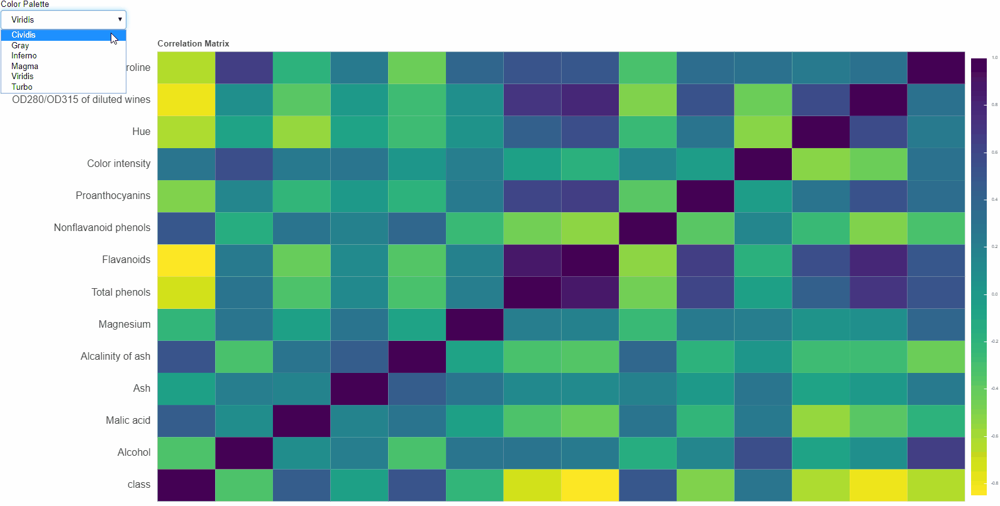

# Visualizing Correlation Matrix using Bokeh - Interactivity and JSCallBacks
I have always been fascinated by what all we can achieve just by coding. Recently when I re-entered the ML space, wanted to do things right this time. So to ease any ML enthusiast's pain, have written some code using Bokeh - Python to get an interactive correlation matrix. I have used the infamous **WINE DATA SET** from the UCI repository. Here is what I came up with:




### Objective
To make a plot such that:

+ It visualises a correlation matrix
+ Provides interactivity the user in the form of:

    + Choosing color scheme
    + Giving user option to alter, save and other basic functionality


To prepare and save a correlation matrix, you can refer to this sample code:
```python
## READING wine.data from WINE DATASET - UCI
with open('wine.data') as myfile:
    x = myfile.read()

## SAVING wine.data in CSV
with open('wine.data.csv','w') as myfile:
    myfile.write(x)

## READING WINE DATA FROM CSV
df = pd.read_csv('wine.data.csv',header=None)
df.columns = ['class','Alcohol','Malic acid','Ash','Alcalinity of ash','Magnesium','Total phenols','Flavanoids','Nonflavanoid phenols','Proanthocyanins','Color intensity','Hue','OD280/OD315 of diluted wines','Proline']

## GENERATING CORRELATION MATRIX
corr_m = df.corr()

## SAVING CORRELATION MATRIX
corr_m.to_csv('wine_correlation.csv')
```

## Acknowledgements
Expressing forever gratefulness for all people associated with [UCI repository](https://archive.ics.uci.edu/ml/index.php).

My sincere thanks to:
Dua, D. and Graff, C. (2019). UCI Machine Learning Repository [http://archive.ics.uci.edu/ml]. Irvine, CA: University of California, School of Information and Computer Science.